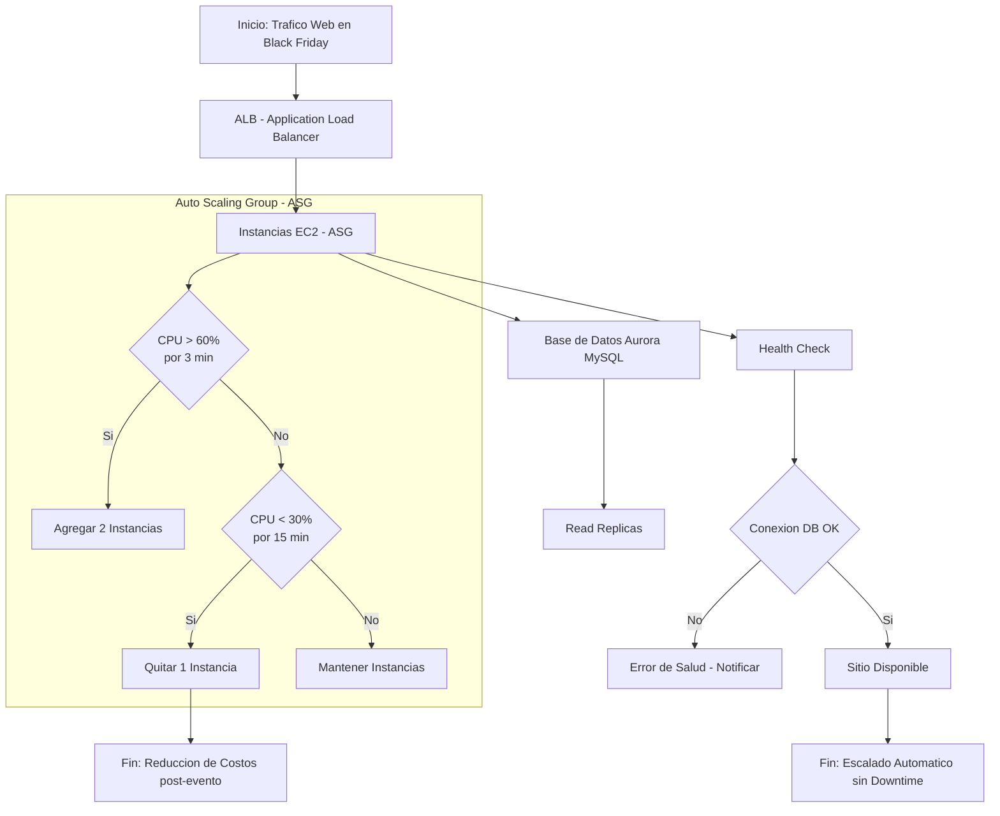

# **Día 4: Balanceo de Carga y Escalabilidad (ELB & ASG) - Detalle Completo**

En este cuarto día, exploraremos cómo distribuir el tráfico y escalar aplicaciones en AWS usando **Elastic Load Balancing (ELB)** y **Auto Scaling Groups (ASG)**. Aprenderemos sobre ALB, NLB, políticas de escalado y realizaremos un laboratorio práctico para configurar una infraestructura auto-escalable.

---

## **1. Elastic Load Balancing (ELB)**
ELB distribuye el tráfico entrante entre múltiples instancias EC2 para mejorar disponibilidad y escalabilidad.

### **a) Tipos de Load Balancers en AWS**

| **Tipo**               | **Capa OSI** | **Características**                                  | **Caso de Uso Típico**                     |
|------------------------|-------------|----------------------------------------------------|-------------------------------------------|
| **Application LB (ALB)** | Capa 7 (HTTP/HTTPS) | Enrutamiento basado en rutas/hosts, soporta contenedores. | Aplicaciones web modernas (microservicios). |
| **Network LB (NLB)**    | Capa 4 (TCP/UDP)  | Ultra baja latencia, maneja millones de solicitudes.  | Juegos online, aplicaciones de alta velocidad. |
| **Classic LB (CLB)**    | Capas 4 y 7 (legado) | Básico, menos funcionalidades (no recomendado para nuevas implementaciones). | Migraciones de aplicaciones antiguas. |

**Ejemplo:**  
- Un sitio de e-commerce usa **ALB** para enrutar `/api` a backend y `/static` a S3.  
- Un servicio de trading financiero usa **NLB** por su baja latencia.  

---

### **b) Componentes Clave de un ALB**
- **Listeners:** Reglas que definen puertos/protocolos (ej: HTTP 80, HTTPS 443).  
- **Target Groups:** Grupos de instancias EC2 (o Lambdas) que reciben tráfico.  
- **Health Checks:** Verifica el estado de las instancias (ej: ruta `/health`).  

**Ejemplo de enrutamiento en ALB:**  
```
Regla 1: Si URL path = "/api/*" → Target Group "backend-services".  
Regla 2: Si host = "static.example.com" → Target Group "static-s3".  
```

---

## **2. Auto Scaling Groups (ASG)**
ASG escala automáticamente el número de instancias EC2 basado en demanda.

### **a) Componentes de ASG**
| **Concepto**            | **Descripción**                                  | **Ejemplo**                              |
|-------------------------|------------------------------------------------|----------------------------------------|
| **Launch Template**     | Configuración base de las instancias (AMI, tipo, SG). | Amazon Linux 2 con Apache preinstalado. |
| **Scaling Policies**    | Reglas para escalar (CPU, memoria, métricas personalizadas). | Escalar si CPU > 70% por 5 minutos.    |
| **Minimum/Maximum Size** | Límites de instancias (evita costos inesperados). | Mín: 2, Máx: 10 instancias.           |

### **b) Tipos de Escalado**
- **Escalado Dinámico:** Basado en métricas (CPU, RAM, tráfico).  
- **Escalado Programado:** Para patrones predecibles (ej: horario laboral).  
- **Escalado Manual:** Ajuste directo por el administrador.  

**Ejemplo:**  
- Un sitio de ventas escala de 2 a 8 instancias en Black Friday (política basada en CPU).  

---

## **3. Laboratorio: Configurar ALB + ASG (Paso a Paso)**
**Objetivo:** Crear un ALB que distribuya tráfico entre instancias EC2 gestionadas por un ASG (basado en CPU).

### **Paso 1: Crear un Launch Template**
1. En la consola AWS, ve a **EC2** → **Launch Templates** → **Create launch template**.  
2. Configura:  
   - **Nombre:** `web-server-template`.  
   - **AMI:** Amazon Linux 2.  
   - **Instance type:** `t2.micro`.  
   - **Key pair:** Usa tu par de claves existente.  
3. En **Advanced details**:  
   - **User data** (script al iniciar):  
     ```bash
     #!/bin/bash
     yum install httpd -y
     systemctl start httpd
     echo "<h1>Servidor $(hostname)</h1>" > /var/www/html/index.html
     ```
   - **Security group:** Permite HTTP (80) y SSH (22 desde tu IP).  

### **Paso 2: Crear un Target Group**
1. Ve a **EC2** → **Target Groups** → **Create target group**.  
2. Configura:  
   - **Nombre:** `web-servers-tg`.  
   - **Protocol:** HTTP 80.  
   - **Health check path:** `/index.html`.  

### **Paso 3: Crear un Application Load Balancer (ALB)**
1. Ve a **EC2** → **Load Balancers** → **Create Load Balancer**.  
2. Selecciona **Application Load Balancer**.  
3. Configura:  
   - **Nombre:** `web-alb`.  
   - **Listeners:** HTTP 80.  
   - **Availability Zones:** Selecciona al menos 2 AZs.  
4. En **Configure Routing**:  
   - Selecciona el target group `web-servers-tg`.  

### **Paso 4: Crear un Auto Scaling Group (ASG)**
1. Ve a **EC2** → **Auto Scaling Groups** → **Create Auto Scaling Group**.  
2. Configura:  
   - **Launch template:** `web-server-template`.  
   - **VPC y subnets:** Selecciona múltiples AZs.  
   - **Group size:** Mín 2, Máx 4, Desired 2.  
3. En **Scaling policies**:  
   - **Target tracking policy:** CPU utilization al 70%.  
4. Asocia el ALB:  
   - Selecciona `web-alb` y `web-servers-tg`.  

### **Paso 5: Probar el Escalado Automático**
1. Genera carga en las instancias (via SSH):  
   ```bash
   sudo stress --cpu 2 --timeout 300  # Simula 100% CPU por 5 minutos.
   ```
2. Monitorea en **EC2** → **Auto Scaling Groups**:  
   - En ~5 minutos, el ASG escalará a más instancias.  
3. Verifica el ALB:  
   - Accede a la **DNS del ALB** (en su descripción) desde un navegador.  
   - Refresca para ver cómo el tráfico se distribuye entre instancias.  

---

## **4. Caso de Uso: E-commerce en Temporada Alta**
**Escenario:** Un sitio de ventas online necesita manejar picos de tráfico en Black Friday.  

### **Arquitectura Propuesta:**
1. **ALB:** Distribuye tráfico entre instancias EC2.  
2. **ASG:** Escala de 4 a 20 instancias basado en:  
   - CPU > 60%.  
   - Número de solicitudes HTTP > 1000/min.  
3. **Base de datos:** Aurora MySQL con Read Replicas.  

### **Configuración Avanzada:**
- **Políticas de Escalado:**  
  - **Scale-out:** Añade 2 instancias si CPU > 60% por 3 minutos.  
  - **Scale-in:** Remueve 1 instancia si CPU < 30% por 15 minutos (evita "flapping").  
- **Health Checks:**  
  - Ruta `/health` que verifica conexión a la base de datos.  

**Resultado:**  
- Durante Black Friday, el sitio escala automáticamente sin downtime.  
- Al finalizar el evento, el ASG reduce instancias para ahorrar costos.  



---

## **Resumen del Día 4**
✅ **Conceptos clave:** ALB, NLB, ASG, políticas de escalado.  
✅ **Laboratorio:** Configurar ALB + ASG con escalado basado en CPU.  
✅ **Caso de uso:** E-commerce que escala en temporada alta.  

**Siguientes pasos:** En el **Día 5** exploraremos **Amazon S3 y CloudFront** para almacenamiento y distribución global de contenido.  
