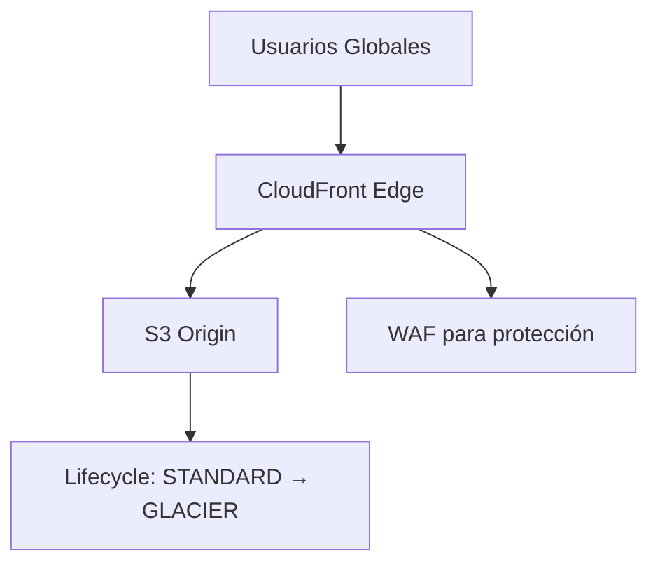

# **Día 5: Amazon S3 y CloudFront - Guía Completa**

## **1. Amazon S3: Conceptos Fundamentales**

### **1.1 Clases de Almacenamiento en S3**

| **Clase de Almacenamiento** | **Durabilidad** | **Disponibilidad** | **Latencia** | **Costo (us-east-1)** | **Caso de Uso** |
|-----------------------------|----------------|-------------------|-------------|----------------------|----------------|
| **S3 Standard** | 99.999999999% | 99.99% | Milisegundos | $0.023/GB | Datos frecuentemente accedidos |
| **S3 Intelligent-Tiering** | 99.999999999% | 99.9% | Milisegundos | $0.023/GB (frecuente), $0.0125/GB (infrecuente) | Datos con patrones de acceso desconocidos |
| **S3 Standard-IA** | 99.999999999% | 99.9% | Milisegundos | $0.0125/GB + $0.01/GB recuperación | Datos accedidos menos de 1 vez/mes |
| **S3 One Zone-IA** | 99.999999999% | 99.5% | Milisegundos | $0.01/GB | Datos no críticos que pueden recrearse |
| **S3 Glacier** | 99.999999999% | 99.99% (3-5 horas) | Minutos a horas | $0.004/GB + $0.03/GB recuperación | Archivos a largo plazo (1-2 accesos/año) |
| **S3 Glacier Deep Archive** | 99.999999999% | 99.99% (12 horas) | Horas | $0.00099/GB + $0.02/GB recuperación | Datos regulatorios (acceso casi nunca) |

**Ejemplo Práctico:**  
- **Sitio web multimedia:**  
  - Imágenes recientes: S3 Standard  
  - Imágenes antiguas: S3 Standard-IA  
  - Backups: S3 Glacier  

### **1.2 Versionado de Objetos**
**Beneficios:**
- Recuperación de objetos eliminados accidentalmente
- Protección contra overwrites no deseados
- Mantenimiento de historial de cambios

**Ejemplo de Caso:**  
Un equipo de desarrollo:
1. Sube `index-v1.html`
2. Actualiza a `index-v2.html`
3. Elimina accidentalmente el archivo
4. Recupera versiones anteriores desde el historial

**Costos:**  
Se paga por todas las versiones almacenadas

### **1.3 Políticas de Lifecycle**
**Tipos de Transiciones:**
1. **S3 Standard → S3 Standard-IA** (después de 30 días)
2. **S3 Standard-IA → S3 Glacier** (después de 90 días)
3. **S3 Glacier → S3 Glacier Deep Archive** (después de 180 días)

**Ejemplo de Configuración JSON:**
```json
{
  "Rules": [
    {
      "ID": "MoveToGlacierAfter1Year",
      "Status": "Enabled",
      "Prefix": "backups/",
      "Transitions": [
        {
          "Days": 365,
          "StorageClass": "GLACIER"
        }
      ]
    }
  ]
}
```

## **2. Amazon CloudFront (CDN)**

### **2.1 Componentes Clave**
- **Distribuciones:** Configuraciones globales de CDN
- **Edge Locations:** +300 puntos de presencia mundial
- **Orígenes:** S3, EC2, ALB, o cualquier servidor web
- **Behaviors:** Reglas de caché (por path, headers, etc.)

### **2.2 Optimización de Performance**
- **TTL (Time-To-Live):**  
  - HTML: 1 minuto  
  - CSS/JS: 1 año  
  - Imágenes: 30 días  

- **Compresión:**  
  - Gzip/Brotli para texto  
  - Hasta 70% reducción  

**Ejemplo de Arquitectura:**
```
Usuario (Madrid) → Edge Location (Madrid) → S3 (us-east-1)
```

## **3. Laboratorio Práctico**

### **Paso 1: Crear Bucket S3 con Versionado**
```bash
aws s3api create-bucket \
  --bucket my-web-assets-$(date +%s) \
  --region us-east-1

aws s3api put-bucket-versioning \
  --bucket my-web-assets-123456789 \
  --versioning-configuration Status=Enabled
```

### **Paso 2: Subir Archivos y Probar Versionado**
```bash
# Subir primera versión
echo "V1 Content" > index.html
aws s3 cp index.html s3://my-web-assets-123456789/

# Modificar y subir nueva versión
echo "V2 Content" > index.html
aws s3 cp index.html s3://my-web-assets-123456789/

# Listar versiones
aws s3api list-object-versions \
  --bucket my-web-assets-123456789 \
  --prefix index.html
```

### **Paso 3: Configurar CloudFront**
```bash
aws cloudfront create-distribution \
  --origin-domain-name my-web-assets-123456789.s3.amazonaws.com \
  --default-root-object index.html \
  --enabled \
  --price-class PriceClass_100 # Solo América y Europa
```

### **Paso 4: Configurar Lifecycle Policy**
```bash
aws s3api put-bucket-lifecycle-configuration \
  --bucket my-web-assets-123456789 \
  --lifecycle-configuration file://lifecycle.json
```

**Contenido de lifecycle.json:**
```json
{
  "Rules": [
    {
      "ID": "TransitionToIA",
      "Status": "Enabled",
      "Prefix": "",
      "Transitions": [{"Days":30, "StorageClass":"STANDARD_IA"}],
      "Expiration": {"Days":365}
    }
  ]
}
```

## **4. Caso de Uso: Distribución Global de Assets**

### **Arquitectura Propuesta**


**Configuración Especial:**
1. **Cache Invalidation:**  
   ```bash
   aws cloudfront create-invalidation \
     --distribution-id EDFDVBD6EXAMPLE \
     --paths "/*"
   ```

2. **Security Headers:**  
   ```json
   "ResponseHeadersPolicy": {
     "SecurityHeadersConfig": {
       "XSS-Protection": {"Override": true, "Value": "1; mode=block"},
       "Frame-Options": {"Override": true, "Value": "DENY"}
     }
   }
   ```

**Resultados Esperados:**
- Tiempo de carga reducido de 2s → 200ms para usuarios internacionales
- Costo de almacenamiento reducido en 60% con políticas lifecycle
- Protección contra hotlinking con signed URLs

## **5. Mejores Prácticas**

### **Seguridad en S3**
- **Block Public Access:** Habilitado por defecto
- **Bucket Policies:**  
  ```json
  {
    "Version": "2012-10-17",
    "Statement": [{
      "Effect": "Allow",
      "Principal": "*",
      "Action": "s3:GetObject",
      "Resource": "arn:aws:s3:::my-bucket/*",
      "Condition": {
        "IpAddress": {"aws:SourceIp": ["192.0.2.0/24"]}
      }
    }]
  }
  ```

### **Optimización de Costos**
1. **S3 Analytics:** Identifica patrones de acceso
2. **Storage Lens:** Dashboard unificado
3. **Transition Early:** Mover a IA después de 30 días

## **Resumen del Día 5**
✅ **Dominio de:** Clases de almacenamiento, versionado, lifecycle policies  
✅ **Habilidad práctica:** Configuración completa S3 + CloudFront  
✅ **Caso real implementado:** CDN global para assets estáticos  

**Próximos pasos:** En el Día 6 exploraremos **Bases de Datos en AWS (RDS y DynamoDB)**.
