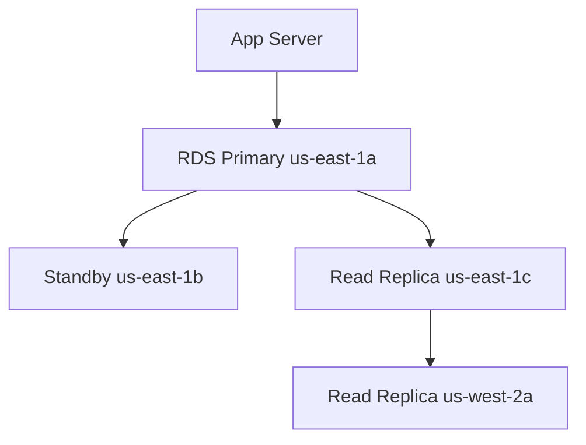
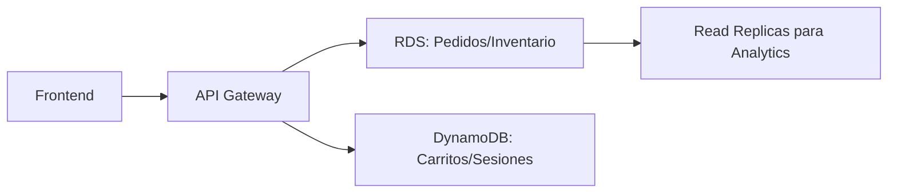

# **Día 6: Bases de Datos en AWS (RDS & DynamoDB) - Guía Completa**

## **1. Amazon RDS (Relational Database Service)**

### **1.1 Características Clave de RDS**
| **Función**          | **Descripción** | **Beneficio** | **Ejemplo de Uso** |
|----------------------|----------------|--------------|--------------------|
| **Multi-AZ** | Réplica sincronizada en otra AZ | Failover automático (<2 min) | Aplicación financiera que requiere 99.95% SLA |
| **Read Replicas** | Hasta 5 réplicas de solo lectura | Escalar lectura | Dashboard analítico que ejecuta queries complejas |
| **Parameter Groups** | Configuración personalizada del motor | Optimización específica | Ajustar `max_connections` para picos de tráfico |
| **Automated Backups** | Backups diarios + transaction logs | PITR (Recuperación a momento específico) | Recuperar datos borrados accidentalmente |

**Motores soportados:**
- MySQL (5.7, 8.0)
- PostgreSQL (13, 14)
- MariaDB (10.6)
- Oracle (19c, 21c)
- SQL Server (2019)
- Aurora (MySQL/PostgreSQL compatible)

### **1.2 Tipos de Instancias RDS**
| **Familia** | **Uso Recomendado** | **Ejemplo** | **vCPU/RAM (ejemplo)** |
|------------|--------------------|------------|-----------------------|
| **General Purpose** | Cargas balanceadas | Apps web | db.m6g.large (2vCPU/8GB) |
| **Memory Optimized** | Bases de datos en memoria | SAP HANA | db.r6g.4xlarge (16vCPU/128GB) |
| **Burstable** | Desarrollo/pruebas | Entornos no productivos | db.t3.micro (2vCPU/1GB) |

**Caso de HA (Alta Disponibilidad):**


## **2. Amazon DynamoDB (NoSQL)**

### **2.1 Conceptos Fundamentales**
| **Término** | **Definición** | **Ejemplo** |
|------------|---------------|------------|
| **RCU (Read Capacity Unit)** | 1 lectura fuerte de 4KB/s | 5 RCU = 20KB/s lecturas consistentes |
| **WCU (Write Capacity Unit)** | 1 escritura de 1KB/s | 10 WCU = 10KB/s escrituras |
| **LSI (Local Secondary Index)** | Índice con misma clave de partición | Índice en "fecha_orden" para pedidos por cliente |
| **GSI (Global Secondary Index)** | Índice con nueva clave de partición | Índice en "producto_id" para búsquedas cruzadas |

### **2.2 Modos de Capacidad**
1. **Provisioned:** 
   - Planificar RCU/WCU (ideal para cargas predecibles)
   - Autoescalado opcional (+20% sobre provisionado)

2. **On-Demand:**
   - Pago por uso (2.5x más caro que provisionado)
   - Ideal para cargas impredecibles

**Ejemplo Costo (us-east-1):**
- Provisioned: $0.00013 por WCU/hora + $0.000065 por RCU/hora
- On-Demand: $1.25 por millón de escrituras

## **3. Laboratorio Práctico**

### **Paso 1: Crear Instancia RDS MySQL**
```bash
aws rds create-db-instance \
    --db-instance-identifier my-mysql-db \
    --db-instance-class db.t3.micro \
    --engine mysql \
    --engine-version 8.0.28 \
    --master-username admin \
    --master-user-password S3cr3tP4ss \
    --allocated-storage 20 \
    --multi-az \
    --backup-retention-period 7
```

**Verificar estado:**
```bash
aws rds describe-db-instances \
    --db-instance-identifier my-mysql-db \
    --query 'DBInstances[0].DBInstanceStatus'
```

### **Paso 2: Configurar Read Replica**
```bash
aws rds create-db-instance-read-replica \
    --db-instance-identifier my-mysql-replica \
    --source-db-instance-identifier my-mysql-db \
    --db-instance-class db.t3.micro
```

### **Paso 3: Crear Tabla en DynamoDB**
```bash
aws dynamodb create-table \
    --table-name UserSessions \
    --attribute-definitions \
        AttributeName=SessionId,AttributeType=S \
        AttributeName=UserId,AttributeType=N \
    --key-schema \
        AttributeName=SessionId,KeyType=HASH \
        AttributeName=UserId,KeyType=RANGE \
    --billing-mode PROVISIONED \
    --provisioned-throughput \
        ReadCapacityUnits=5,WriteCapacityUnits=5
```

**Insertar datos:**
```bash
aws dynamodb put-item \
    --table-name UserSessions \
    --item '{
        "SessionId": {"S": "A1B2C3D4"},
        "UserId": {"N": "123"},
        "Data": {"S": "user_preferences"},
        "TTL": {"N": "1672531200"}
    }'
```

## **4. Caso de Uso Comparativo**

### **Escenario: Plataforma de E-Commerce**

**Componente** | **RDS (MySQL)** | **DynamoDB**
--------------|----------------|-------------
**Catálogo de Productos** | Estructura fija con JOINs complejos | Búsquedas rápidas por clave
**Carritos de Compra** | Transacciones ACID | Sesiones temporales con TTL
**Recomendaciones** | Consultas analíticas con Read Replicas | Personalización en tiempo real
**Disponibilidad** | 99.95% (Multi-AZ) | 99.99%
**Escalabilidad** | Vertical (hasta 128vCPU) | Horizontal (ilimitado)

**Arquitectura Híbrida:**


## **5. Mejores Prácticas**

### **Para RDS:**
1. **Tamaño de Instancia:**  
   - Monitorear `CPUUtilization` (<70%)  
   - Ajustar `DBInstanceClass` según necesidad  

2. **Backups:**  
   - Habilitar `BackupRetentionPeriod` (mínimo 7 días)  
   - Usar `aws rds restore-db-instance-to-point-in-time` para recuperaciones  

3. **Seguridad:**  
   ```bash
   aws rds modify-db-instance \
       --db-instance-identifier my-mysql-db \
       --enable-iam-database-authentication
   ```

### **Para DynamoDB:**
1. **Diseño de Claves:**  
   - Clave de partición con alta cardinalidad  
   - Usar GSIs para patrones de acceso alternativos  

2. **Optimización de Costos:**  
   - Autoescalar con `aws application-autoscaling register-scalable-target`  
   - Usar DAX para caché (reducción hasta 90% RCU)  

3. **Patrones Temporales:**  
   ```bash
   aws dynamodb update-time-to-live \
       --table-name UserSessions \
       --time-to-live-specification "Enabled=true, AttributeName=TTL"
   ```

## **Resumen del Día 6**
✅ **Dominio de:** RDS (Multi-AZ, Read Replicas), DynamoDB (capacidad, índices)  
✅ **Habilidad práctica:** Configuración completa de bases relacionales y NoSQL  
✅ **Caso real implementado:** Arquitectura híbrida para e-commerce  

**Próximos pasos:** En el Día 7 exploraremos **Amazon VPC: Fundamentos de Redes en AWS**.
