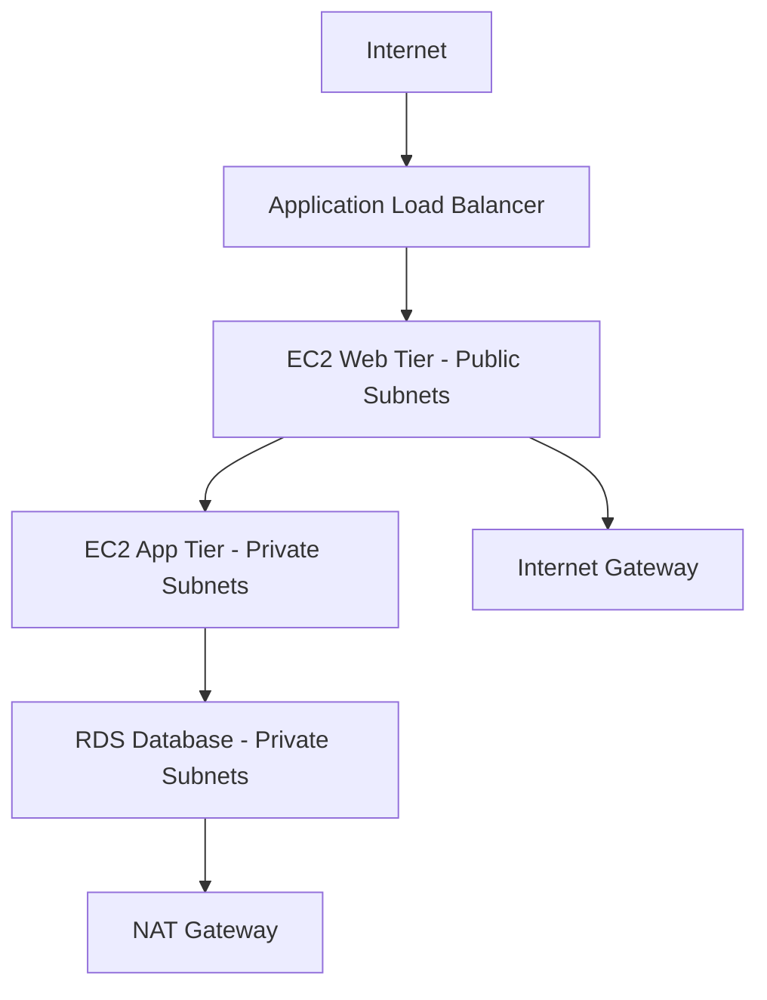

# **Día 7: Amazon VPC (Fundamentos)**

## **1. Conceptos Clave de Amazon VPC**

### **1.1 Componentes Fundamentales**

| **Componente**       | **Función**                                                                 | **Ejemplo de Uso**                                                                 |
|----------------------|-----------------------------------------------------------------------------|-----------------------------------------------------------------------------------|
| **VPC (Virtual Private Cloud)** | Red virtual aislada lógicamente en AWS                                     | Crear un entorno aislado para la infraestructura de una empresa                   |
| **Subnet**           | Segmento de IPs dentro de una VPC (por AZ)                                 | `10.0.1.0/24` en us-east-1a (pública), `10.0.2.0/24` en us-east-1b (privada)     |
| **Internet Gateway** | Puerta de enlace para tráfico público (saliente/entrante)                  | Permitir que instancias EC2 en subnets públicas accedan a internet                |
| **NAT Gateway**      | Permite tráfico saliente a internet desde subnets privadas (sin acceso entrante) | Bases de datos en subnets privadas que necesitan actualizaciones de seguridad     |
| **Route Tables**     | Tablas de enrutamiento que definen el flujo de tráfico                     | Enrutar tráfico de subnets privadas a través del NAT Gateway                      |

### **1.2 Tipos de Subnets**

| **Tipo de Subnet** | **Características**                                  | **Ejemplo de Uso**                          |
|--------------------|----------------------------------------------------|--------------------------------------------|
| **Pública**        | Tiene ruta a Internet Gateway                      | Servidores web frontend                    |
| **Privada**        | Sin acceso directo a internet (usa NAT Gateway)    | Bases de datos, backend services           |
| **Aislada**        | Sin acceso a internet (solo comunicación interna)  | Capa de datos ultra-segura                 |

## **2. Laboratorio: Crear VPC con Subnets Públicas/Privadas**

### **Paso 1: Crear VPC**
```bash
aws ec2 create-vpc \
    --cidr-block 10.0.0.0/16 \
    --tag-specifications 'ResourceType=vpc,Tags=[{Key=Name,Value=ProdVPC}]'
```
**Salida:** Anotar `VpcId` (ej: vpc-1234567890abcdef0)

### **Paso 2: Crear Subnets**
```bash
# Subnet Pública en us-east-1a
aws ec2 create-subnet \
    --vpc-id vpc-1234567890abcdef0 \
    --cidr-block 10.0.1.0/24 \
    --availability-zone us-east-1a \
    --tag-specifications 'ResourceType=subnet,Tags=[{Key=Name,Value=PublicSubnet1A}]'

# Subnet Privada en us-east-1b
aws ec2 create-subnet \
    --vpc-id vpc-1234567890abcdef0 \
    --cidr-block 10.0.2.0/24 \
    --availability-zone us-east-1b \
    --tag-specifications 'ResourceType=subnet,Tags=[{Key=Name,Value=PrivateSubnet1B}]'
```

### **Paso 3: Crear Internet Gateway**
```bash
aws ec2 create-internet-gateway \
    --tag-specifications 'ResourceType=internet-gateway,Tags=[{Key=Name,Value=ProdIGW}]'
```
**Asociar a VPC:**
```bash
aws ec2 attach-internet-gateway \
    --internet-gateway-id igw-1234567890abcdef0 \
    --vpc-id vpc-1234567890abcdef0
```

### **Paso 4: Configurar NAT Gateway**
1. **Asignar IP Elástica:**
```bash
aws ec2 allocate-address --domain vpc
```
2. **Crear NAT Gateway en subnet pública:**
```bash
aws ec2 create-nat-gateway \
    --subnet-id subnet-1234567890abcdef0 \
    --allocation-id eipalloc-1234567890abcdef0 \
    --tag-specifications 'ResourceType=natgateway,Tags=[{Key=Name,Value=ProdNAT}]'
```

### **Paso 5: Configurar Tablas de Rutas**
**Para Subnet Pública:**
```bash
aws ec2 create-route-table \
    --vpc-id vpc-1234567890abcdef0 \
    --tag-specifications 'ResourceType=route-table,Tags=[{Key=Name,Value=PublicRT}]'

aws ec2 create-route \
    --route-table-id rtb-1234567890abcdef0 \
    --destination-cidr-block 0.0.0.0/0 \
    --gateway-id igw-1234567890abcdef0

aws ec2 associate-route-table \
    --route-table-id rtb-1234567890abcdef0 \
    --subnet-id subnet-1234567890abcdef0
```

**Para Subnet Privada:**
```bash
aws ec2 create-route-table \
    --vpc-id vpc-1234567890abcdef0 \
    --tag-specifications 'ResourceType=route-table,Tags=[{Key=Name,Value=PrivateRT}]'

aws ec2 create-route \
    --route-table-id rtb-234567890abcdef1 \
    --destination-cidr-block 0.0.0.0/0 \
    --nat-gateway-id nat-1234567890abcdef0

aws ec2 associate-route-table \
    --route-table-id rtb-234567890abcdef1 \
    --subnet-id subnet-234567890abcdef1
```

## **3. Caso de Uso: Arquitectura de 3 Capas**

### **Diagrama de Arquitectura**


**Configuración por Capa:**

| **Capa**      | **Subnet**   | **Recursos**                     | **Conectividad**                          |
|---------------|-------------|----------------------------------|------------------------------------------|
| **Web**       | Pública      | ALB, EC2 con Apache/Nginx        | Acceso directo desde internet            |
| **Aplicación**| Privada      | EC2 con NodeJS/Java              | Solo comunicación interna (Web → App)    |
| **Datos**     | Privada      | RDS, ElastiCache                 | Solo comunicación desde App Tier         |

### **Mejores Prácticas de Seguridad**
1. **NACLs (Network ACLs):**
   - Capa adicional de firewall (stateless)
   - Reglas ejemplares:
     ```bash
     aws ec2 create-network-acl-entry \
         --network-acl-id acl-1234567890abcdef0 \
         --ingress \
         --rule-number 100 \
         --protocol tcp \
         --port-range From=80,To=80 \
         --cidr-block 0.0.0.0/0 \
         --rule-action allow
     ```

2. **Security Groups:**
   - Reglas stateful (se aplican a instancias)
   - Ejemplo para capa web:
     ```bash
     aws ec2 authorize-security-group-ingress \
         --group-id sg-1234567890abcdef0 \
         --protocol tcp \
         --port 80 \
         --cidr 0.0.0.0/0
     ```

## **4. Pruebas de Conectividad**

### **Desde Instancia Pública:**
```bash
# Conectar via SSH
ssh -i keypair.pem ec2-user@<IP-Pública>

# Probar conexión a internet
ping google.com

# Probar conexión a instancia privada
ping 10.0.2.50
```

### **Desde Instancia Privada:**
```bash
# Probar acceso a internet (via NAT)
curl https://aws.amazon.com

# Probar conexión a RDS
mysql -h mydb.1234567890.us-east-1.rds.amazonaws.com -u admin -p
```

## **5. Optimización de Costos**

| **Componente**   | **Estrategia de Ahorro**                | **Ahorro Estimado** |
|------------------|----------------------------------------|--------------------|
| **NAT Gateway**  | Usar NAT Instances para cargas pequeñas | Hasta 70%          |
| **VPC Peering**  | Conectar VPCs sin salida a internet    | Elimina costos NAT |
| **IPs Elásticas**| Asociar solo cuando sea necesario       | $3.60/IP/mes       |

**Comando para monitorear costos:**
```bash
aws ce get-cost-and-usage \
    --time-period Start=2023-01-01,End=2023-01-31 \
    --granularity MONTHLY \
    --metrics "BlendedCost" \
    --group-by Type=DIMENSION,Key=SERVICE
```

## **Resumen del Día 7**
✅ **Dominio de:** Subnets, IGW, NAT Gateway, tablas de rutas  
✅ **Habilidad práctica:** Configuración completa de VPC empresarial  
✅ **Caso real implementado:** Arquitectura de 3 capas con aislamiento de seguridad  

**Próximos pasos:** En el Día 8 exploraremos **VPC Avanzado: Peering, Endpoints y VPN**.
