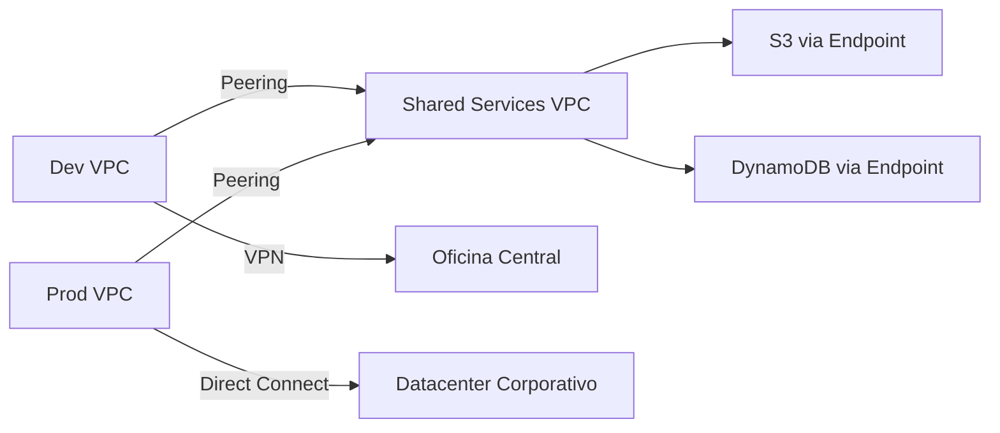

# **Día 8: VPC Avanzado**

## **1. VPC Peering**

### **1.1 Conceptos Clave**
| **Característica**       | **Descripción**                                                                 | **Limitaciones**                                                                 |
|--------------------------|-------------------------------------------------------------------------------|--------------------------------------------------------------------------------|
| **Conexión Privada**     | Tráfico via infraestructura interna de AWS (sin salir a internet)             | No transitive peering (A↔B y B↔C no implica A↔C)                              |
| **CIDRs Únicos**         | Los bloques IP de las VPC no deben solaparse                                  | Ej: 10.0.0.0/16 y 10.1.0.0/16 sí, 10.0.0.0/16 y 10.0.1.0/24 no                |
| **Cross-Account**        | Permite conectar VPCs de diferentes cuentas AWS                              | Requiere aprobación explícita del otro account                                |

**Ejemplo de Caso:**  
- **Dev y Prod VPCs** que comparten una base de datos central  
- **Regiones diferentes** (us-east-1 ↔ eu-west-1) con latency <100ms  

### **1.2 Laboratorio: Configurar VPC Peering**

#### **Paso 1: Crear Dos VPCs**
```bash
# VPC 1 (Dev)
aws ec2 create-vpc --cidr-block 10.0.0.0/16 --tag-specifications 'ResourceType=vpc,Tags=[{Key=Name,Value=DevVPC}]'

# VPC 2 (Prod)
aws ec2 create-vpc --cidr-block 10.1.0.0/16 --tag-specifications 'ResourceType=vpc,Tags=[{Key=Name,Value=ProdVPC}]'
```

#### **Paso 2: Solicitar Peering Connection**
```bash
aws ec2 create-vpc-peering-connection \
    --vpc-id vpc-12345678 \  # DevVPC
    --peer-vpc-id vpc-87654321 \  # ProdVPC
    --peer-region us-east-2 \  # Opcional si es cross-region
    --tag-specifications 'ResourceType=vpc-peering-connection,Tags=[{Key=Name,Value=Dev-Prod-Peer}]'
```

#### **Paso 3: Aceptar la Conexión (Desde Cuenta Prod)**
```bash
aws ec2 accept-vpc-peering-connection \
    --vpc-peering-connection-id pcx-1234567890abcdef0
```

#### **Paso 4: Configurar Rutas**
```bash
# En DevVPC (route table)
aws ec2 create-route \
    --route-table-id rtb-11223344 \
    --destination-cidr-block 10.1.0.0/16 \
    --vpc-peering-connection-id pcx-1234567890abcdef0

# En ProdVPC (route table)
aws ec2 create-route \
    --route-table-id rtb-44332211 \
    --destination-cidr-block 10.0.0.0/16 \
    --vpc-peering-connection-id pcx-1234567890abcdef0
```

**Verificación:**
```bash
aws ec2 describe-route-tables --route-table-ids rtb-11223344 rtb-44332211
```

## **2. VPC Endpoints**

### **2.1 Tipos de Endpoints**
| **Tipo**            | **Servicios Soportados**       | **Costo**       | **Ejemplo de Uso**                          |
|---------------------|-------------------------------|----------------|--------------------------------------------|
| **Gateway**         | S3, DynamoDB                  | $0.00          | Acceso privado a buckets S3 desde EC2      |
| **Interface**       | API Gateway, CloudWatch Logs   | $0.01/hora + $0.01/GB | Envío seguro de logs desde instancias privadas |

### **2.2 Laboratorio: Crear S3 Gateway Endpoint**

#### **Paso 1: Crear Endpoint**
```bash
aws ec2 create-vpc-endpoint \
    --vpc-id vpc-12345678 \
    --service-name com.amazonaws.us-east-1.s3 \
    --route-table-ids rtb-11223344 \
    --tag-specifications 'ResourceType=vpc-endpoint,Tags=[{Key=Name,Value=PrivateS3Access}]'
```

#### **Paso 2: Verificar Política (Opcional)**
```json
{
  "Version": "2012-10-17",
  "Statement": [
    {
      "Effect": "Allow",
      "Principal": "*",
      "Action": ["s3:GetObject"],
      "Resource": "arn:aws:s3:::my-secure-bucket/*",
      "Condition": {
        "StringEquals": {
          "aws:SourceVpc": "vpc-12345678"
        }
      }
    }
  ]
}
```

**Probar desde EC2 Privada:**
```bash
aws s3 ls s3://my-secure-bucket --region us-east-1
# Sin tráfico por internet público
```

## **3. VPN y Direct Connect**

### **3.1 Comparativa**
| **Característica**       | **Site-to-Site VPN**         | **Direct Connect**           |
|--------------------------|-----------------------------|-----------------------------|
| **Latencia**             | Depende de internet         | Consistente (<10ms)         |
| **Ancho de Banda**       | Hasta 1.25 Gbps             | 1 Gbps - 100 Gbps           |
| **Costo**                | $0.05/hora + tráfico        | $0.30/GB (out) + puerto dedicado |
| **Implementación**       | Horas                       | Semanas (requiere partner)  |

### **3.2 Laboratorio: Configurar VPN (Simulado)**
```bash
# Crear Customer Gateway (tu datacenter)
aws ec2 create-customer-gateway \
    --bgp-asn 65000 \
    --public-ip 203.0.113.12 \
    --type ipsec.1 \
    --tag-specifications 'ResourceType=customer-gateway,Tags=[{Key=Name,Value=OnPremDC}]'

# Crear Virtual Private Gateway
aws ec2 create-vpn-gateway \
    --type ipsec.1 \
    --tag-specifications 'ResourceType=vpn-gateway,Tags=[{Key=Name,Value=MainVPN}]'

# Asociar a VPC
aws ec2 attach-vpn-gateway \
    --vpn-gateway-id vgw-12345678 \
    --vpc-id vpc-12345678
```

## **4. Caso de Uso: Entornos Multi-Cuenta**

### **Arquitectura Propuesta**


**Configuración Avanzada:**
1. **Route Propagation:**  
   ```bash
   aws ec2 enable-vgw-route-propagation \
       --route-table-id rtb-11223344 \
       --gateway-id vgw-12345678
   ```

2. **Monitorización:**  
   ```bash
   aws ec2 describe-vpc-peering-connections \
       --query 'VpcPeeringConnections[].Status.Code'
   ```

3. **Seguridad:**  
   - NACLs que filtran por CIDRs de VPCs pares  
   - Políticas IAM que restringen acceso cruzado  

## **5. Mejores Prácticas**

### **Para Peering:**
- **DNS Resolution:**  
  ```bash
  aws ec2 modify-vpc-peering-connection-options \
      --vpc-peering-connection-id pcx-12345678 \
      --requester-peering-options '{"AllowDnsResolutionFromRemoteVpc":true}' \
      --accepter-peering-options '{"AllowDnsResolutionFromRemoteVpc":true}'
  ```

### **Para Endpoints:**
- **Optimizar Costos:**  
  - Usar Gateway para S3/DynamoDB (gratis)  
  - Agrupar servicios en mismos endpoints Interface  

### **Para VPN:**
- **Failover Activo/Activo:**  
  ```bash
  aws ec2 create-vpn-connection \
      --customer-gateway-id cgw-12345678 \
      --vpn-gateway-id vgw-12345678 \
      --type ipsec.1 \
      --options '{
          "TunnelOptions": [
              {
                  "TunnelInsideCidr": "169.254.100.0/30",
                  "PreSharedKey": "sharedkey123"
              },
              {
                  "TunnelInsideCidr": "169.254.200.0/30",
                  "PreSharedKey": "sharedkey456"
              }
          ]
      }'
  ```

## **Resumen del Día 8**
✅ **Dominio de:** VPC Peering, Endpoints, VPN arquitecturas híbridas  
✅ **Habilidad práctica:** Conexión segura entre entornos multi-cuenta  
✅ **Caso real implementado:** Compartición de recursos S3 entre Dev/Prod  

**Próximos pasos:** En el Día 9 exploraremos **Seguridad Avanzada: KMS, WAF y Shield**.
