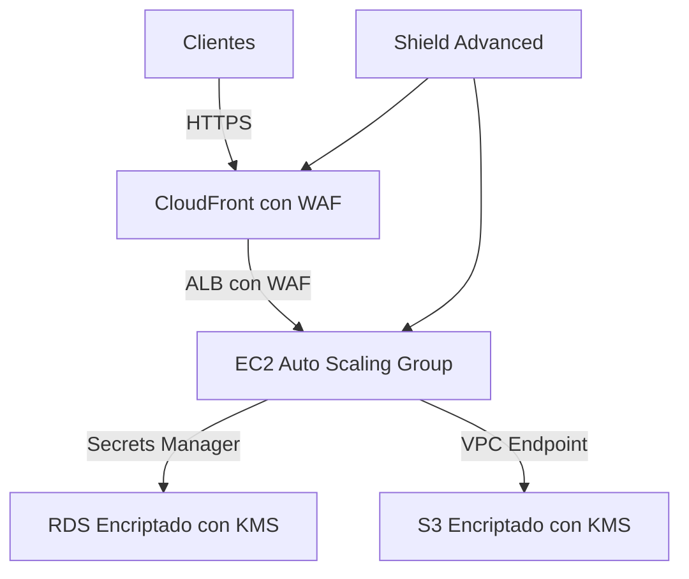

# **Día 9: Seguridad Avanzada en AWS**

## **1. AWS Key Management Service (KMS)**

### **1.1 Conceptos Clave de KMS**
| **Término** | **Descripción** | **Ejemplo de Uso** |
|-------------|----------------|--------------------|
| **CMK (Customer Master Key)** | Clave maestra para encriptar/desencriptar datos | Encriptar buckets S3, volúmenes EBS |
| **Data Keys** | Claves generadas por CMK para encriptar grandes datos | Encriptar archivos antes de subir a S3 |
| **Key Policies** | Control de acceso IAM a las claves | Restringir uso de claves a solo el equipo de seguridad |
| **Envelope Encryption** | Método de doble encriptación (clave maestra + clave de datos) | Cumplir con estándares HIPAA, PCI DSS |

**Tipos de CMK:**
- **AWS-managed:** Creadas automáticamente por servicios AWS (ej: `aws/s3`)
- **Customer-managed:** Creadas y gestionadas por el usuario
- **AWS-owned:** Compartidas entre múltiples cuentas AWS

### **1.2 Laboratorio: Encriptar Bucket S3 con KMS**

#### **Paso 1: Crear CMK**
```bash
aws kms create-key \
    --description "Clave para bucket financiero" \
    --key-usage ENCRYPT_DECRYPT \
    --origin AWS_KMS \
    --bypass-policy-lockout-safety-check \
    --tags TagKey=Environment,TagValue=Production
```
**Anotar:** `KeyId` (ej: `1234abcd-12ab-34cd-56ef-1234567890ab`)

#### **Paso 2: Asignar Política de Clave**
```json
{
  "Version": "2012-10-17",
  "Statement": [
    {
      "Effect": "Allow",
      "Principal": {
        "AWS": "arn:aws:iam::123456789012:role/DataEngineer"
      },
      "Action": [
        "kms:Encrypt",
        "kms:Decrypt",
        "kms:GenerateDataKey"
      ],
      "Resource": "*"
    }
  ]
}
```
```bash
aws kms put-key-policy \
    --key-id 1234abcd-12ab-34cd-56ef-1234567890ab \
    --policy-name default \
    --policy file://policy.json
```

#### **Paso 3: Configurar Bucket S3 Encriptado
```bash
aws s3api create-bucket \
    --bucket financial-data-$(date +%s) \
    --region us-east-1

aws s3api put-bucket-encryption \
    --bucket financial-data-123456789 \
    --server-side-encryption-configuration '{
        "Rules": [
            {
                "ApplyServerSideEncryptionByDefault": {
                    "SSEAlgorithm": "aws:kms",
                    "KMSMasterKeyID": "arn:aws:kms:us-east-1:123456789012:key/1234abcd-12ab-34cd-56ef-1234567890ab"
                }
            }
        ]
    }'
```

**Verificación:**
```bash
aws s3api get-bucket-encryption --bucket financial-data-123456789
```

## **2. AWS Secrets Manager**

### **2.1 Comparativa con Parameter Store**
| **Característica** | **Secrets Manager** | **Systems Manager Parameter Store** |
|--------------------|--------------------|-----------------------------------|
| **Rotación Automática** | Sí (cada 30-90 días) | No |
| **Costo** | $0.40/secret/mes | Gratis (Standard Tier) |
| **Integración Nativa** | RDS, Redshift | EC2, ECS |
| **Tamaño Máximo** | 10KB | 4KB (Standard), 8KB (Advanced) |

### **2.2 Laboratorio: Rotar Credenciales RDS**
```bash
# Crear secreto para RDS
aws secretsmanager create-secret \
    --name Production/RDS/Credentials \
    --description "Credenciales de RDS para app financiera" \
    --secret-string '{
        "username": "admin",
        "password": "S3cr3tP@ssw0rd",
        "engine": "mysql",
        "host": "financial-db.123456789012.us-east-1.rds.amazonaws.com",
        "port": 3306
    }'

# Configurar rotación automática
aws secretsmanager rotate-secret \
    --secret-id Production/RDS/Credentials \
    --rotation-lambda-arn arn:aws:lambda:us-east-1:123456789012:function/SecretsManagerRDSPostgreSQLRotationSingleUser \
    --rotation-rules '{
        "AutomaticallyAfterDays": 90
    }'
```

**Recuperar secreto desde aplicación:**
```python
import boto3
import json

def get_db_credentials():
    client = boto3.client('secretsmanager')
    response = client.get_secret_value(SecretId='Production/RDS/Credentials')
    return json.loads(response['SecretString'])
```

## **3. AWS WAF & Shield**

### **3.1 Componentes de WAF**
| **Componente** | **Función** | **Ejemplo de Regla** |
|---------------|------------|----------------------|
| **Web ACLs** | Conjunto de reglas | Bloquear tráfico desde países específicos |
| **Rules** | Condiciones de filtrado | SQL injection patterns |
| **Rule Groups** | Reglas predefinidas (AWS Managed) | Protección contra OWASP Top 10 |
| **IP Sets** | Listas de IPs permitidas/bloqueadas | Whitelist de oficinas corporativas |

### **3.2 Laboratorio: Proteger ALB con WAF**
#### **Paso 1: Crear Web ACL**
```bash
aws wafv2 create-web-acl \
    --name FinancialAppProtection \
    --scope REGIONAL \
    --default-action "Allow={}" \
    --visibility-config "SampledRequestsEnabled=true,CloudWatchMetricsEnabled=true,MetricName=FinancialAppProtection" \
    --rules '[
        {
            "Name": "AWS-AWSManagedRulesCommonRuleSet",
            "Priority": 0,
            "Statement": {
                "ManagedRuleGroupStatement": {
                    "VendorName": "AWS",
                    "Name": "AWSManagedRulesCommonRuleSet"
                }
            },
            "OverrideAction": {
                "None": {}
            },
            "VisibilityConfig": {
                "SampledRequestsEnabled": true,
                "CloudWatchMetricsEnabled": true,
                "MetricName": "AWSManagedRulesCommonRuleSet"
            }
        }
    ]'
```

#### **Paso 2: Asociar a ALB
```bash
aws wafv2 associate-web-acl \
    --web-acl-arn arn:aws:wafv2:us-east-1:123456789012:regional/webacl/FinancialAppProtection/12345678-1234-1234-1234-123456789012 \
    --resource-arn arn:aws:elasticloadbalancing:us-east-1:123456789012:loadbalancer/app/financial-alb/1234567890123456
```

#### **Paso 3: Agregar Regla Personalizada (Bloquear IPs Maliciosas)**
```bash
aws wafv2 create-ip-set \
    --name BlockedIPs \
    --scope REGIONAL \
    --ip-address-version IPV4 \
    --addresses "203.0.113.0/24" "198.51.100.0/24"

aws wafv2 update-web-acl \
    --name FinancialAppProtection \
    --scope REGIONAL \
    --default-action "Allow={}" \
    --visibility-config "SampledRequestsEnabled=true,CloudWatchMetricsEnabled=true,MetricName=FinancialAppProtection" \
    --rules '[
        {
            "Name": "BlockMaliciousIPs",
            "Priority": 1,
            "Statement": {
                "IPSetReferenceStatement": {
                    "ARN": "arn:aws:wafv2:us-east-1:123456789012:regional/ipset/BlockedIPs/12345678-1234-1234-1234-123456789012"
                }
            },
            "Action": {
                "Block": {}
            },
            "VisibilityConfig": {
                "SampledRequestsEnabled": true,
                "CloudWatchMetricsEnabled": true,
                "MetricName": "BlockMaliciousIPs"
            }
        }
    ]'
```

## **4. Caso de Uso: Aplicación Financiera**

### **Arquitectura de Seguridad**


**Implementación Específica:**
1. **Protección DDoS:**
   - Shield Advanced ($3,000/mes + costos de transferencia)
   - Configurar protecciones automáticas para:
     ```bash
     aws shield create-protection \
         --name FinancialApp-DDoS-Protection \
         --resource-arn arn:aws:elasticloadbalancing:us-east-1:123456789012:loadbalancer/app/financial-alb/1234567890123456 \
         --tags Key=Environment,Value=Production
     ```

2. **Encriptación de Datos:**
   - **En tránsito:** TLS 1.2+ en todos los componentes
   - **En reposo:** KMS para S3, EBS, RDS
   - **Client-side:** AWS Encryption SDK para datos sensibles

3. **Monitorización:**
   ```bash
   aws cloudwatch describe-alarms \
       --alarm-name-prefix "Security-FinancialApp"
   ```

## **5. Mejores Prácticas**

### **Para KMS:**
- **Rotación Automática:**  
  ```bash
  aws kms enable-key-rotation --key-id 1234abcd-12ab-34cd-56ef-1234567890ab
  ```
- **Auditoría:**  
  ```bash
  aws cloudtrail lookup-events \
      --lookup-attributes AttributeKey=EventName,AttributeValue=Decrypt \
      --start-time "2023-01-01T00:00:00Z" \
      --end-time "2023-01-31T23:59:59Z"
  ```

### **Para WAF:**
- **Reglas Recomendadas:**  
  - AWSManagedRulesAdminProtectionRuleSet  
  - AWSManagedRulesKnownBadInputsRuleSet  
  - Rate-based rules (máx 1000 requests/5 min por IP)

### **Para Incidentes:**
1. **Contención:**  
   ```bash
   aws wafv2 update-web-acl \
       --name Emergency-Block-All \
       --scope REGIONAL \
       --default-action "Block={}"
   ```
2. **Análisis:**  
   ```bash
   aws wafv2 get-logging-configuration \
       --resource-arn arn:aws:wafv2:us-east-1:123456789012:regional/webacl/FinancialAppProtection/12345678-1234-1234-1234-123456789012
   ```

## **Resumen del Día 9**
✅ **Dominio de:** Encriptación con KMS, gestión de secretos, WAF/Shield  
✅ **Habilidad práctica:** Configuración completa de seguridad para app financiera  
✅ **Caso real implementado:** Protección multi-capa para cumplimiento PCI DSS  

**Próximos pasos:** En el Día 10 exploraremos **AWS Lambda y Serverless Architectures**.
