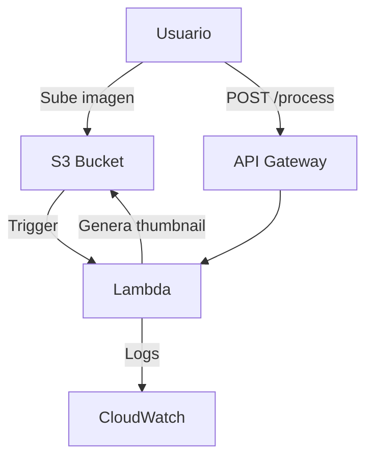

# **Día 10: AWS Lambda y API Gateway**

## **1. AWS Lambda: Conceptos Fundamentales**

### **1.1 Características Clave**
| **Concepto** | **Descripción** | **Ejemplo** |
|-------------|----------------|------------|
| **Runtime** | Entorno de ejecución (Python, Node.js, Java, etc.) | Python 3.9 para procesamiento rápido de imágenes |
| **Triggers** | Eventos que invocan la función (S3, DynamoDB, API Gateway) | Subida de archivos a S3 |
| **Capas** | Paquetes compartidos entre funciones | Librerías de procesamiento de imágenes |
| **Concurrencia** | Ejecuciones paralelas (hasta 1,000 por defecto) | Procesar múltiples imágenes simultáneamente |

**Límites Importantes:**
- **Tiempo máximo de ejecución:** 15 minutos
- **Memoria:** 128MB a 10GB
- **Tamaño de paquete:** 50MB (compressed), 250MB (uncompressed)

### **1.2 Modelo de Precios**
- **Pago por milisegundo de ejecución**
- **Ejemplo de costo:**
  - 1M invocaciones/mes con 1s de duración y 512MB = ~$1.00

## **2. Laboratorio: Procesamiento de Imágenes con Lambda**

### **Paso 1: Crear Función Lambda**
```bash
aws lambda create-function \
    --function-name ImageProcessor \
    --runtime python3.9 \
    --role arn:aws:iam::123456789012:role/lambda-execution-role \
    --handler lambda_function.handler \
    --zip-file fileb://function.zip \
    --environment "Variables={THUMBNAIL_SIZE=128}" \
    --memory-size 512 \
    --timeout 30
```

**Contenido de `lambda_function.py`:**
```python
import boto3
from PIL import Image
import io
import os

s3 = boto3.client('s3')
THUMBNAIL_SIZE = int(os.environ['THUMBNAIL_SIZE'])

def handler(event, context):
    # Obtener información del archivo subido
    bucket = event['Records'][0]['s3']['bucket']['name']
    key = event['Records'][0]['s3']['object']['key']
    
    # Descargar imagen
    file_obj = s3.get_object(Bucket=bucket, Key=key)
    image = Image.open(io.BytesIO(file_obj['Body'].read()))
    
    # Crear thumbnail
    image.thumbnail((THUMBNAIL_SIZE, THUMBNAIL_SIZE))
    
    # Guardar thumbnail
    buffer = io.BytesIO()
    image.save(buffer, "JPEG")
    buffer.seek(0)
    
    thumbnail_key = f"thumbnails/{key.split('/')[-1]}"
    s3.put_object(
        Bucket=bucket,
        Key=thumbnail_key,
        Body=buffer,
        ContentType='image/jpeg'
    )
    
    return {
        'statusCode': 200,
        'body': f'Thumbnail generado: {thumbnail_key}'
    }
```

### **Paso 2: Configurar Permisos IAM**
**Política para el Rol Lambda:**
```json
{
  "Version": "2012-10-17",
  "Statement": [
    {
      "Effect": "Allow",
      "Action": [
        "logs:CreateLogGroup",
        "logs:CreateLogStream",
        "logs:PutLogEvents"
      ],
      "Resource": "arn:aws:logs:*:*:*"
    },
    {
      "Effect": "Allow",
      "Action": [
        "s3:GetObject",
        "s3:PutObject"
      ],
      "Resource": "arn:aws:s3:::mi-bucket-imagenes/*"
    }
  ]
}
```

### **Paso 3: Configurar Trigger S3**
```bash
aws lambda add-permission \
    --function-name ImageProcessor \
    --principal s3.amazonaws.com \
    --statement-id s3-trigger \
    --action "lambda:InvokeFunction" \
    --source-arn arn:aws:s3:::mi-bucket-imagenes

aws s3api put-bucket-notification-configuration \
    --bucket mi-bucket-imagenes \
    --notification-configuration '{
        "LambdaFunctionConfigurations": [
            {
                "LambdaFunctionArn": "arn:aws:lambda:us-east-1:123456789012:function:ImageProcessor",
                "Events": ["s3:ObjectCreated:*"],
                "Filter": {
                    "Key": {
                        "FilterRules": [
                            {
                                "Name": "suffix",
                                "Value": ".jpg"
                            }
                        ]
                    }
                }
            }
        ]
    }'
```

## **3. API Gateway: Crear API REST**

### **Paso 1: Crear API REST**
```bash
aws apigateway create-rest-api \
    --name 'ImageProcessingAPI' \
    --description 'API para procesamiento de imágenes' \
    --endpoint-configuration '{"types": ["REGIONAL"]}'
```

### **Paso 2: Crear Recurso y Método**
```bash
# Obtener ID del API
API_ID=$(aws apigateway get-rest-apis --query "items[?name=='ImageProcessingAPI'].id" --output text)

# Crear recurso
RESOURCE_ID=$(aws apigateway create-resource \
    --rest-api-id $API_ID \
    --parent-id $(aws apigateway get-resources --rest-api-id $API_ID --query "items[0].id" --output text) \
    --path-part "process" --query "id" --output text)

# Crear método POST
aws apigateway put-method \
    --rest-api-id $API_ID \
    --resource-id $RESOURCE_ID \
    --http-method POST \
    --authorization-type "NONE" \
    --request-parameters '{"method.request.header.Content-Type": false}'
```

### **Paso 3: Integrar con Lambda
```bash
aws apigateway put-integration \
    --rest-api-id $API_ID \
    --resource-id $RESOURCE_ID \
    --http-method POST \
    --type AWS_PROXY \
    --integration-http-method POST \
    --uri arn:aws:apigateway:us-east-1:lambda:path/2015-03-31/functions/arn:aws:lambda:us-east-1:123456789012:function:ImageProcessor/invocations

aws lambda add-permission \
    --function-name ImageProcessor \
    --statement-id apigateway-test \
    --action lambda:InvokeFunction \
    --principal apigateway.amazonaws.com \
    --source-arn "arn:aws:execute-api:us-east-1:123456789012:${API_ID}/*/POST/process"
```

### **Paso 4: Desplegar API**
```bash
aws apigateway create-deployment \
    --rest-api-id $API_ID \
    --stage-name prod
```

## **4. Caso de Uso: Procesamiento de Imágenes Serverless**

### **Arquitectura Completa**


**Flujo de Procesamiento:**
1. Usuario sube imagen.jpg a `s3://mi-bucket-imagenes/originales/`
2. Lambda se activa automáticamente
3. Procesa la imagen y guarda thumbnail en `s3://mi-bucket-imagenes/thumbnails/`
4. También puede ser invocada manualmente via API Gateway

### **Optimización de Costos**
- **Reserva de Concurrencia:** Para cargas predecibles
  ```bash
  aws lambda put-function-concurrency \
      --function-name ImageProcessor \
      --reserved-concurrent-executions 100
  ```
- **Configuración de Memoria:**  
  - Pruebas con diferentes configuraciones (128MB vs 512MB vs 1024MB)
  - Uso de AWS Lambda Power Tuning

## **5. Mejores Prácticas**

### **Para Lambda:**
- **Manejo de Conexiones:**  
  ```python
  # Reutilizar clientes fuera del handler
  s3 = boto3.client('s3')
  
  def handler(event, context):
      # Usar cliente existente
  ```

- **Manejo de Errores:**  
  ```python
  try:
      # Procesamiento
  except Exception as e:
      print(f"Error: {str(e)}")
      raise e
  ```

### **Para API Gateway:**
- **Cache:**  
  ```bash
  aws apigateway update-stage \
      --rest-api-id $API_ID \
      --stage-name prod \
      --patch-operations 'op=replace,path=/cacheClusterEnabled,value=true'
  ```
  
- **Throttling:**  
  ```bash
  aws apigateway update-stage \
      --rest-api-id $API_ID \
      --stage-name prod \
      --patch-operations 'op=replace,path=/defaultRouteSettings/throttlingBurstLimit,value=100'
  ```

## **Resumen del Día 10**
✅ **Dominio de:** Arquitectura serverless, triggers Lambda, integración con API Gateway  
✅ **Habilidad práctica:** Sistema completo de procesamiento de imágenes  
✅ **Caso real implementado:** Pipeline para generación de thumbnails  

**Próximos pasos:** En el Día 11 exploraremos **AWS Step Functions para orquestación de flujos de trabajo**.
